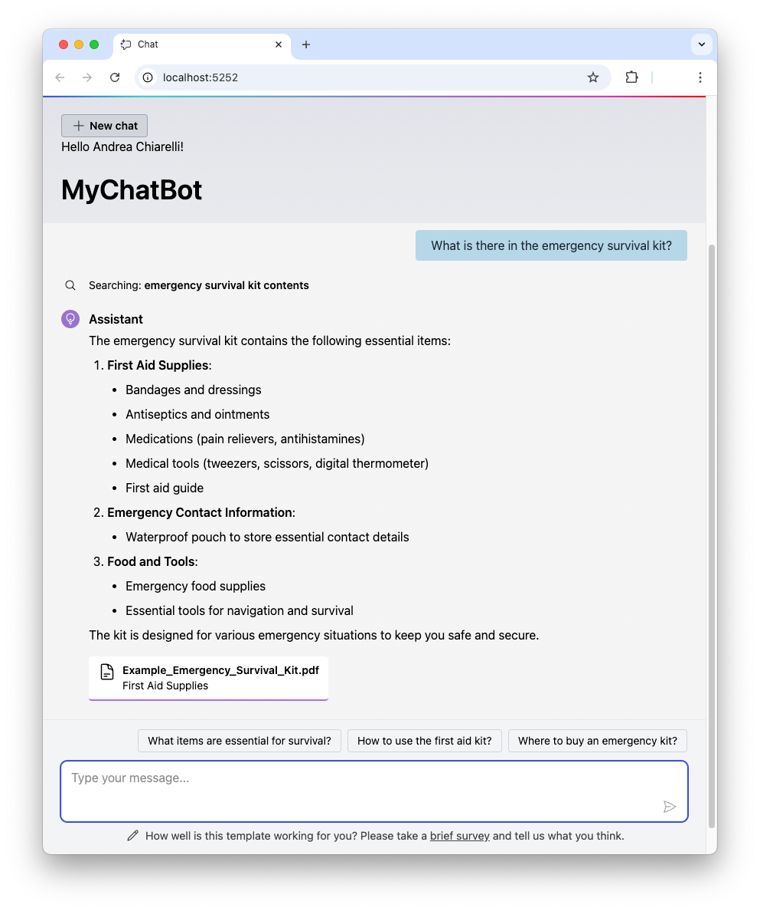

This repository contains a sample project showing how to build an AI chatbot using Retrieval Augmented Generation (RAG) to enrich its responses, and how to protect it with Auth0 and OpenFGA.

Read the article [Secure a .NET RAG System with Auth0 FGA](https://auth0.com/blog/secure-dotnet-rag-system-with-auth0-fga/) to learn more.

> ⚠️ This project is intended for demonstration purposes only and is not meant for production use. ⚠️

## Requirements

To build and run this project you need:

- [.NET SDK 10](https://dotnet.microsoft.com/en-us/download/dotnet/10.0) or a later version.
- An Auth0 account. You can [signup for free](https://auth0.com/signup).

## To run this application

1. Clone the repo with the following command:

   ```
   git clone https://github.com/auth0-samples/blazor-chatbot-rag.git
   ```

   

2. Move to the `blazor-chatbot-rag` folder.

3. Create a [personal access token for GitHub Models](https://learn.microsoft.com/en-us/dotnet/ai/quickstarts/ai-templates?tabs=visual-studio%2Cconfigure-visual-studio%2Cconfigure-visual-studio-aspire&pivots=github-models#configure-access-to-github-models).

4. Register the application with Auth0 as a [regular web application](https://auth0.com/docs/get-started/auth0-overview/create-applications/regular-web-apps).

5. Define an [authorization model in Auth0 FGA](https://auth0.com/blog/secure-dotnet-rag-system-with-auth0-fga/#Defining-Permissions-with-Auth0-FGA).

6. Register the application as [an Auth0 FGA client](https://docs.fga.dev/integration/getting-your-api-keys).

7. Provide the registration values in the `appsettings.json` file.

8. Run the application in Visual Studio or the .NET CLI.



## License
Copyright 2026 Okta, Inc.

This project is licensed under the Apache License 2.0. See the [LICENSE](LICENSE.txt) file for more info.